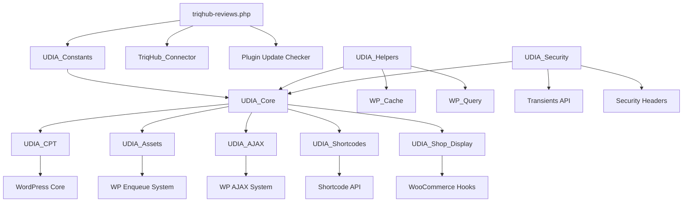
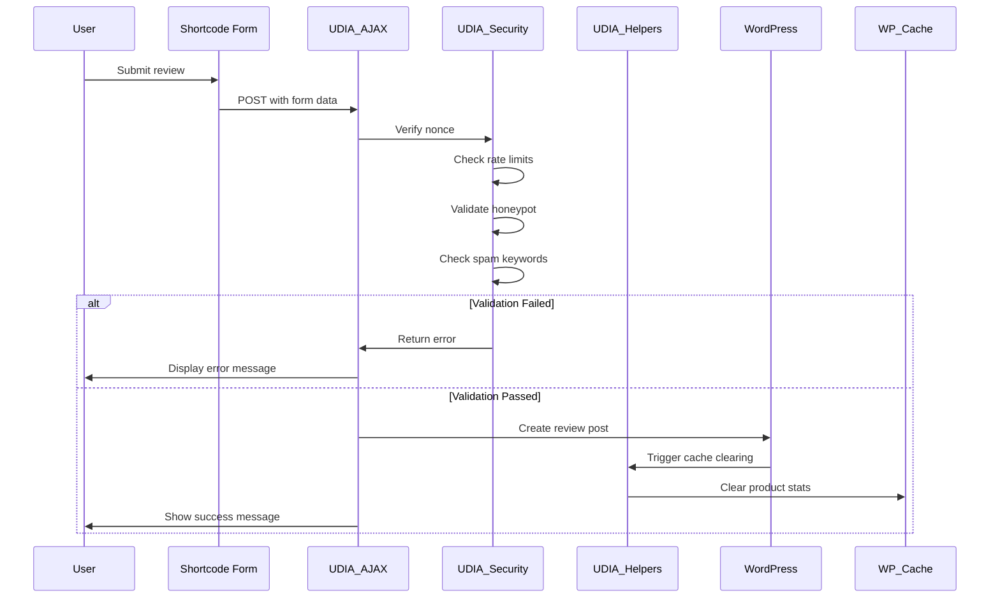
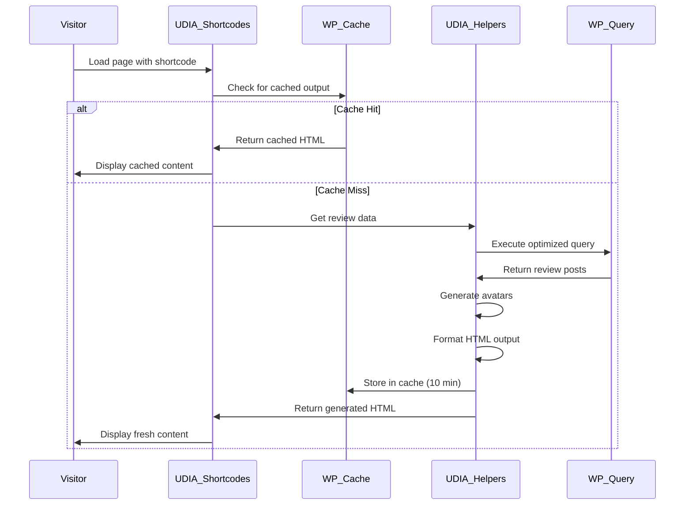
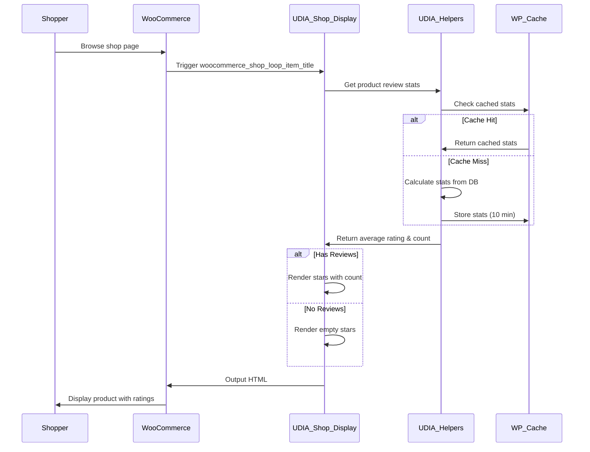

# TriqHub: Reviews Plugin - Architecture Documentation

## 1. Overview

**TriqHub: Reviews** is a WordPress plugin designed for WooCommerce stores that provides a comprehensive review system with form submission, list display, carousel presentation, and direct product page integration. The plugin features a unified, centralized, and responsive layout with advanced security, caching, and performance optimizations.

### Key Features
- **Multi-format Display**: Form, list, carousel, and product-specific review displays
- **WooCommerce Integration**: Direct product association and shop loop integration
- **Advanced Security**: Rate limiting, spam detection, honeypot fields, and activity logging
- **Performance Optimized**: Fragment caching, database indexing, and optimized queries
- **Responsive Design**: Mobile-first CSS with dark/light theme compatibility
- **Extensible Architecture**: Modular class structure with clear separation of concerns

## 2. Directory Structure

```
triqhub-reviews/
├── triqhub-reviews.php              # Main plugin file
├── includes/
│   ├── core/
│   │   └── class-triqhub-connector.php  # TriqHub invisible connector
│   ├── class-udia-constants.php     # Constants and configuration
│   ├── class-udia-helpers.php       # Utility functions and caching
│   ├── class-udia-security.php      # Security features
│   ├── class-udia-cpt.php           # Custom Post Type registration
│   ├── class-udia-assets.php        # CSS/JS asset management
│   ├── class-udia-ajax.php          # AJAX handlers
│   ├── class-udia-shortcodes.php    # Shortcode implementations
│   ├── class-udia-shop-display.php  # Shop loop integration
│   └── class-udia-core.php          # Core plugin controller
├── assets/
│   ├── css/
│   │   ├── triqhub-admin.css        # Admin styling
│   │   └── [plugin-styles.css]      # Frontend styles
│   └── js/
│       └── [plugin-scripts.js]      # Frontend scripts
├── languages/                       # Translation files
├── vendor/                          # Composer dependencies
│   └── [plugin-update-checker]      # GitHub update checker
└── templates/                       # Template overrides (optional)
```

## 3. Database Schema

### 3.1 Custom Post Type: `reviews`
The plugin uses WordPress's built-in post type system with custom meta fields:

```sql
-- WordPress posts table (wp_posts)
-- post_type = 'reviews'
-- post_status = 'publish' (for public reviews)

-- Custom meta fields (wp_postmeta):
-- meta_key = 'rating'           INT(1-5)      Star rating
-- meta_key = 'prod_id'          INT           Associated product ID
-- meta_key = 'variation_id'     INT           Product variation ID (optional)
-- meta_key = 'product_label'    VARCHAR(255)  Display product name
-- meta_key = 'order_item_id'    INT           WooCommerce order item ID
```

### 3.2 Database Indexes
For performance optimization, the plugin creates custom indexes:

```sql
-- Index on product_id for faster product-specific queries
ALTER TABLE wp_postmeta 
ADD INDEX idx_udia_prod_id (meta_key(20), meta_value(20));

-- Index on rating for faster aggregations
ALTER TABLE wp_postmeta 
ADD INDEX idx_udia_rating (meta_key(20), meta_value(5));
```

### 3.3 Transients and Caching
- **Fragment Caching**: Shortcode output cached for 10 minutes
- **Statistics Caching**: Product/global review stats cached
- **Rate Limiting**: IP-based attempt tracking via transients
- **Security Logs**: Limited to last 100 entries in options table

## 4. Core Components Architecture

### 4.1 Class Dependency Diagram



### 4.2 Component Responsibilities

#### **UDIA_Constants**
- **Purpose**: Central configuration management
- **Key Data**: Plugin paths, cache groups, rate limits, text lengths
- **Pattern**: Static configuration class

#### **UDIA_Core**
- **Purpose**: Main controller and dependency injector
- **Pattern**: Singleton with lazy initialization
- **Responsibilities**:
  - Initialize all plugin components
  - Register cache cleanup hooks
  - Ensure single instance

#### **UDIA_CPT**
- **Purpose**: Custom Post Type registration
- **Responsibilities**:
  - Register 'reviews' post type with proper labels
  - Enable REST API support
  - Configure archive and rewrite rules

#### **UDIA_Helpers**
- **Purpose**: Utility functions and performance optimizations
- **Key Methods**:
  - `get_cached_fragment()`: Fragment caching system
  - `generate_initials_avatar()`: Dynamic avatar generation
  - `get_product_review_stats()`: Optimized statistics calculation
  - `create_meta_indexes()`: Database optimization

#### **UDIA_Security**
- **Purpose**: Comprehensive security layer
- **Key Features**:
  - IP-based rate limiting
  - Spam detection with keyword filtering
  - Honeypot field implementation
  - Activity logging with rotation
  - Content Security Policy headers

#### **UDIA_Shortcodes**
- **Purpose**: Frontend display components
- **Shortcodes**:
  - `[udia_review_v2_form]`: Review submission form
  - `[udia_review_v2_list]`: Review listing
  - `[udia_review_v2_carousel]`: Responsive carousel
  - `[udia_product_review_summary]`: Product rating summary
  - `[udia_product_full_reviews]`: Product-specific reviews
  - `[udia_global_review_summary]`: Global rating display

#### **UDIA_Shop_Display**
- **Purpose**: WooCommerce shop loop integration
- **Hook**: `woocommerce_shop_loop_item_title` (priority 5)
- **Features**:
  - Automatic star rating display
  - Review count with neon styling
  - Responsive CSS with theme compatibility
  - Empty state handling

#### **UDIA_AJAX**
- **Purpose**: Handle form submissions and dynamic content
- **Endpoints**:
  - `udia_v2_submit_review`: Review submission with validation
  - `udia_v2_get_order_items`: Fetch user's recent orders
- **Security**: Nonce verification, rate limiting, spam checks

#### **UDIA_Assets**
- **Purpose**: CSS and JavaScript management
- **Features**:
  - Conditional loading based on context
  - Inline styles for critical components
  - Dependency management

## 5. Design Patterns

### 5.1 Singleton Pattern
```php
// UDIA_Core implementation
class UDIA_Core {
    private static $instance = null;
    
    public static function get_instance() {
        if (null === self::$instance) {
            self::$instance = new self();
        }
        return self::$instance;
    }
    
    private function __construct() {
        // Private constructor
    }
}
```

### 5.2 Dependency Injection
- **UDIA_Core** acts as service container
- Components initialized in correct order
- Loose coupling between classes

### 5.3 Strategy Pattern
- **Shortcodes** implement different display strategies
- **Security** uses multiple detection strategies
- **Caching** supports different TTL strategies

### 5.4 Observer Pattern
- **WordPress hooks** for event-driven architecture
- **Cache invalidation** on post changes
- **Security logging** on suspicious activities

## 6. Core Logic Flows

### 6.1 Review Submission Flow



### 6.2 Review Display Flow



### 6.3 Shop Integration Flow



## 7. Security Architecture

### 7.1 Multi-Layer Protection
```
┌─────────────────────────────────────┐
│         User Submission             │
├─────────────────────────────────────┤
│  Layer 1: Honeypot Field           │
│  • Hidden from users               │
│  • Auto-filled by bots             │
├─────────────────────────────────────┤
│  Layer 2: Nonce Verification       │
│  • WordPress security tokens       │
│  • Prevents CSRF attacks           │
├─────────────────────────────────────┤
│  Layer 3: Rate Limiting            │
│  • IP-based attempt tracking       │
│  • Configurable limits             │
├─────────────────────────────────────┤
│  Layer 4: Spam Detection           │
│  • Keyword filtering               │
│  • Link count checking             │
│  • Character repetition detection  │
├─────────────────────────────────────┤
│  Layer 5: Input Validation         │
│  • Text length limits              │
│  • HTML sanitization               │
│  • SQL injection prevention        │
└─────────────────────────────────────┘
```

### 7.2 Security Headers
```php
// Implemented in UDIA_Security::add_csp_headers()
Content-Security-Policy: default-src 'self';
X-Content-Type-Options: nosniff;
X-Frame-Options: SAMEORIGIN;
X-XSS-Protection: 1; mode=block;
```

## 8. Performance Optimizations

### 8.1 Caching Strategy
```php
// Three-tier caching approach
1. Fragment Caching: Shortcode output (10 minutes)
2. Statistics Caching: Product/global stats (10 minutes)
3. Query Optimization: Database indexes and optimized WP_Query

// Cache groups
define('CACHE_GROUP_FRAGMENTS', 'udia_fragments');
define('CACHE_GROUP_REVIEWS', 'udia_reviews');
```

### 8.2 Database Optimization
- **Selective Field Loading**: `'fields' => 'ids'` for statistics
- **No Found Rows**: `'no_found_rows' => true` for count queries
- **Meta Query Optimization**: Proper indexing on frequently queried fields
- **Batch Processing**: Efficient rating calculations

### 8.3 Asset Optimization
- **Conditional Loading**: Assets only on pages that need them
- **Inline Critical CSS**: Shop display styles inline for faster rendering
- **Async Loading**: JavaScript with proper dependencies

## 9. Extension Points

### 9.1 Filters and Actions
```php
// Available filters
apply_filters('udia_log_suspicious_activity', $should_log, $type);
apply_filters('udia_review_form_before_submit', $form_html);
apply_filters('udia_review_display_args', $args);

// Available actions
do_action('udia_review_submitted', $review_id, $user_id);
do_action('udia_review_displayed', $review_ids);
```

### 9.2 Template Overrides
```php
// Template hierarchy (if implemented)
1. theme/triqhub-reviews/{template-name}.php
2. plugin/templates/{template-name}.php
3. plugin default template
```

### 9.3 Custom Shortcode Attributes
```php
// Extendable via shortcode_atts()
[udia_review_v2_list posts_per_page="50" order="ASC"]
[udia_review_v2_carousel autoplay="true" interval="5000"]
```

## 10. Error Handling and Logging

### 10.1 Error Types Handled
- **WooCommerce Dependency**: Admin notice if missing
- **Database Errors**: Graceful fallback with logging
- **Security Violations**: Silent logging with optional alerts
- **Cache Failures**: Fallback to direct queries

### 10.2 Logging System
```php
// Security logging (WP_DEBUG only)
UDIA_Security::log_suspicious_activity($type, $data);

// Error logging via WordPress
error_log('[UDIA Reviews] ' . $message);

// Transient-based rate limit tracking
set_transient($key, $attempts + 1, $period);
```

## 11. Internationalization

### 11.1 Translation Ready
- **Text Domain**: `udia-reviews-v2`
- **Language Files**: `/languages/` directory
- **Contextual Translations**: Proper translator comments
- **RTL Support**: CSS prepared for right-to-left languages

### 11.2 Localized Strings
```php
// All user-facing strings wrapped
__( 'Submit Review', 'udia-reviews-v2' );
_n( '%d review', '%d reviews', $count, 'udia-reviews-v2' );
```

## 12. Deployment and Updates

### 12.1 Update System
- **GitHub Integration**: Automatic updates via GitHub releases
- **Release Assets**: Properly packaged updates
- **Version Checking**: Semantic versioning support
- **Backward Compatibility**: Legacy constant support

### 12.2 Activation/Deactivation
```php
// Activation: Create indexes, flush rules
register_activation_hook(__FILE__, 'udia_v2_activate');

// Deactivation: Clean up transients (optional)
register_deactivation_hook(__FILE__, 'udia_v2_deactivate');
```

## 13. Browser Compatibility

### 13.1 Supported Browsers
- **Modern Browsers**: Chrome 60+, Firefox 55+, Safari 12+, Edge 79+
- **Mobile**: iOS Safari 12+, Chrome Mobile 60+
- **Fallbacks**: Graceful degradation for older browsers

### 13.2 CSS Features Used
- **CSS Variables**: Theme customization
- **Flexbox**: Layout management
- **CSS Grid**: Carousel layout (optional)
- **Media Queries**: Responsive design
- **CSS Transitions**: Smooth animations

## 14. Testing Considerations

### 14.1 Test Scenarios
1. **Form Submission**: Valid/invalid data, spam attempts
2. **Display Rendering**: Empty/full lists, carousel navigation
3. **Shop Integration**: Various product types, no reviews scenario
4. **Cache Behavior**: Hit/miss scenarios, invalidation
5. **Security Features**: Rate limiting, spam detection

### 14.2 Performance Benchmarks
- **Page Load**: < 100ms additional load time
- **Database Queries**: < 5 additional queries per page
- **Memory Usage**: < 10MB additional memory
